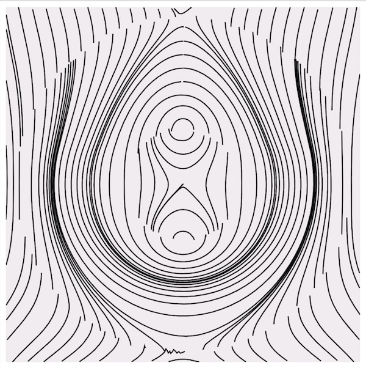
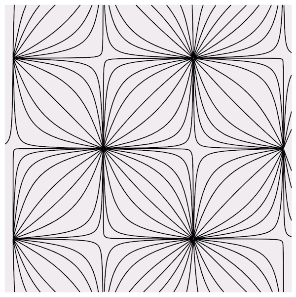
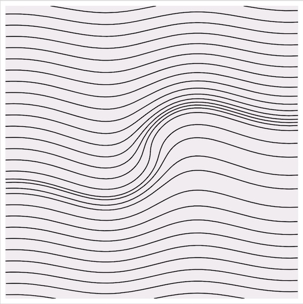
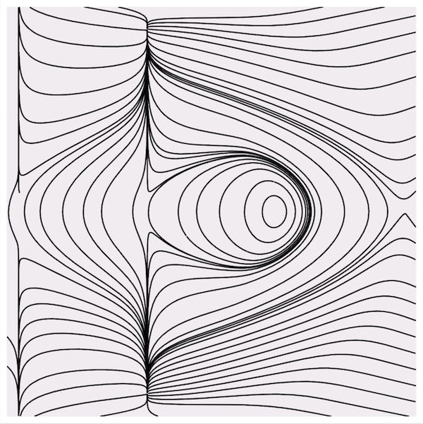

# Flow Lines

> A Vue.js project for generating SVGs based on mathematical formulas.

# Interface


# Features

- Input formula for x / y to get flow field / streamlines / flow lines visualization
- Adjust different parameters such as allowed integration time, separation distance, line parameters
- Save output as SVG graphics
- Mark favorite outputs and come back to them during the same "session" 
- Shareable URLs

# Samples

Here are some samples of artworks created with this tool:






# Support Creator

If you find this tool useful, I'd like to encourage you to support my efforts by buying me coffee or giving any other amount on these platforms:

- Patreon: https://www.patreon.com/msurguy
- Open Collective: https://opencollective.com/drawingbots-community
- Ko-Fi: https://ko-fi.com/msurguy

## Build Setup

``` bash
# install dependencies
npm install

# serve with hot reload at localhost:8080
npm run dev

# build for production with minification
npm run build
```

## Project is using:

- Vue.js
- Streamlines calculator (https://github.com/anvaka/streamlines)
- SVG.js
- Math.js
- Query state (https://www.npmjs.com/package/query-state)

## License

MIT
